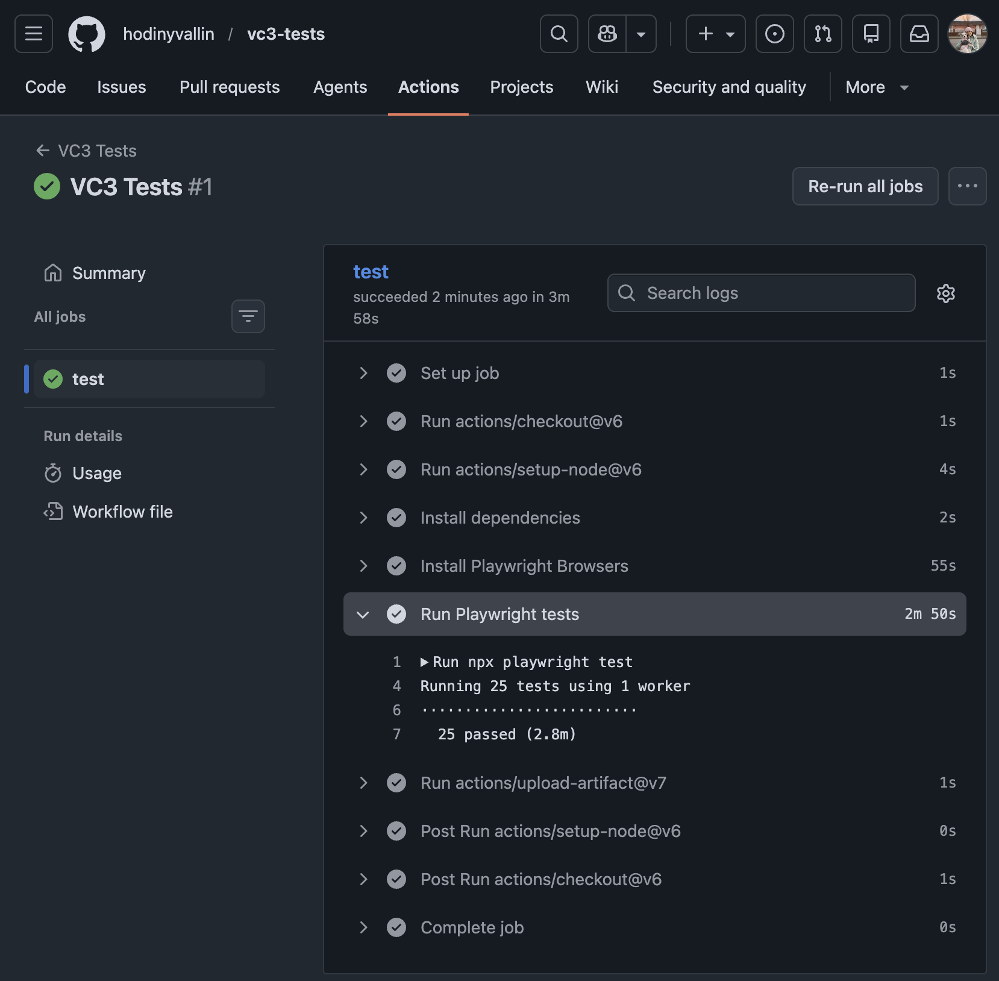

## Micro-Automation Framework for VC3's Contact Form Feature

> Built specifically for VC3's contact form - "Let's talk about how VC3 can help you AIM higher".
> This framework demonstrates a reliable, maintainable approach to automated UI testing for critical lead-generation on VC3's main website.

> **Stack:** Playwright, JavaScript, GitHub Actions, Faker.

---

### Test Coverage

`contactForm.spec.js` targets the high-value contact form submission flow with these test cases:

- Happy path: User can submit a contact form
- Negative path: User receives validation message when required fields are left blank
- Negative path: User receives validation message when email is invalid
- Negative path: User receives validation message when phone number contains invalid characters
- Negative path: User receives validation message when phone number is fewer than 7 digits

**Note on production safety:** The final `click()` event on the "SEND MESSAGE" button is intentionally omitted in the first test to protect VC3's team from receiving automated test spam.

---

### Page Object Model

- To reduce code duplication, this framework utilizes the Page Object Model pattern.
- Page element locators and user interactions (such as handling cookie banners, navigation, and form inputs) are encapsulated within a dedicated `HomePage.js` page object.
- Test scripts focus on executing test logic and assertions, keeping them clean and readable.

---

### Test Data Management

- To ensure test isolation and replicate real-world user behaviors, dynamic mock data is managed programmatically.
- `contactFormData.js` exports a helper function that leverages the `faker` library to generate randomized, fresh mock data (names, emails, phone numbers, messages, etc.) at runtime.
- Invalid inputs used in the negative tests are declared explicitly at the test level for readability.

---

### Cross-Browser and Mobile Web Responsiveness

- To maximize test coverage, the test suite runs concurrently across multiple simulated desktop and mobile environments, configured in `playwright.config.js`.
- **Desktop:** Chromium, Firefox, and WebKit.
- **Mobile Viewports:** Mobile Chrome (emulating a Pixel 5 viewport) and Mobile Safari (emulating an iPhone 12 viewport).

---

### Run in CI

This framework is integrated with GitHub Actions for automated continuous integration. To run all tests in GitHub Actions:

1. Go to the repository Actions tab.
2. Select the "VC3 Tests" workflow from the left panel.
3. Click on the "Run workflow" button on the top right.

**Note**: The `workflow_dispatch` event trigger enables us to manually run tests with a click on the "Run workflow" button. Tests also run on every pull request via the same workflow.

---

### Run locally

To run tests locally:

1. Clone this repository to your local machine.
2. Ensure you have `Node.js` and `npm` installed.
3. Install the project dependencies and Playwright Browsers to your local repository:
   ```
   npm install && npx playwright install
   ```
4. Run the tests using one of these commands:

    | Mode           | Command                            |
    | -------------- | ---------------------------------- |
    | Headless       | `npx playwright test`              |
    | Headed         | `npx playwright test --headed`     |
    | Test Runner UI | `npx playwright test --ui`         |
    | One file       | `npx playwright test name.spec.js` |
    | Debug          | `npx playwright test --debug`      |

---

### Test Report

To view a HTML report of the test run:

1. Go to the repository Actions tab.
2. Select the most recent run of the "VC3 Tests" workflow.
3. Go to Summary on the left panel.
4. Scroll down to Artifacts.
5. Download `playwright-report.zip`.
6. Open the `index.html` file to view the test report.

---

### Test Results

_25 tests passed in CI:_



---

💼 _[See more frameworks and artifacts in my portfolio](https://github.com/hodinyvallin/portfolio)_  
🏠 _[Back to my GitHub profile](https://github.com/hodinyvallin)_
